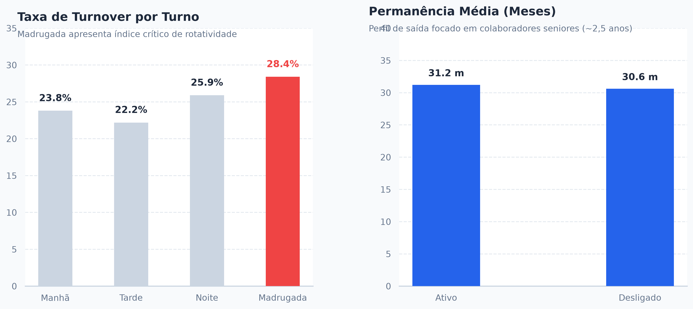

# People Analytics: Análise de Rotatividade e Absenteísmo no Atendimento

> **Estudo de Caso:** Diagnóstico e mitigação de *turnover* operacional a partir do tratamento e análise estatística de dados de atendimento.

---

## Visão Geral do Projeto

Este estudo foi desenvolvido para identificar os principais vetores de rotatividade (*turnover*) e absenteísmo em uma operação de atendimento ao cliente. 

O projeto cobre desde o ciclo de tratamento da base bruta com higienização contra duplicidades e eliminação de *outliers* através do **Intervalo Interquartil (IQR)**, até a extração de *insights* estratégicos para tomada de decisão em gestão de pessoas e operações.

---

## Dashboard de Resultados

---

## Tratamento e Higienização de Dados

Antes das análises exploratórias, a base passou por dois filtros rigorosos para garantir a integridade dos resultados:

1. **Validação de Duplicidades:** Remoção de registros duplicados oriundos de falhas de log, preservando a amostragem limpa ($N = 500$).
2. **Tratamento de Outliers (Método IQR):** Aplicação do cálculo de quartis para identificar e remover volumes discrepantes na variável de chamados diários e ausências irreais:

$$IQR = Q_3 - Q_1$$
$$\text{Limite Superior} = Q_3 + 1.5 \times IQR$$

---

## Principais Achados & Diagnósticos

### 1. Gargalo Operacional no Turno Noturno
* O turno da **Madrugada** apresentou o maior índice de desligamentos (**28,41%**), superando significativamente a média dos demais turnos (Tarde: **22,20%**, Manhã: **23,80%**).
* **Conclusão:** O desgaste e as condições associadas ao trabalho noturno atuam como o principal direcionador de saída de colaboradores.

### 2. Perfil de Saída: Foco em Colaboradores Seniores
* A permanência média dos colaboradores desligados é de **30,6 meses** (~2,5 anos), praticamente igual à média dos ativos (**31,2 meses**).
* **Conclusão:** A operação não sofre com a retenção inicial (novatos em *onboarding*), mas sim com a perda recorrente de profissionais experientes que atingem um teto na empresa.

### 3. Carga Diária de Chamados vs. Absenteísmo
* A correlação estatística entre o volume diário de chamados e os dias de falta foi nula ($r = 0,02$).
* **Conclusão:** O absenteísmo não é explicado de forma simples por picos de chamados diários, indicando a necessidade de avaliar fatores qualitativos de clima e liderança.

---

## Recomendações Estratégicas

*  **Ações para o Turno da Madrugada:** Implementação de adicionais de permanência, readequação de escalas e suporte específico à saúde para mitigar a rotatividade no período noturno.
*  **Plano de Retenção de Seniores:** Construção de trilhas de carreira e incentivos estruturados para profissionais que atingem a marca de 2 anos na operação.
*  **Monitoramento Qualitativo de Clima:** Avaliação periódica de fatores ergonômicos e suporte gerencial para compreender a origem do absenteísmo fora das métricas de volume.

---

## Tecnologias e Bibliotecas

* **Linguagem:** Python 
* **Análise de Dados:** Pandas, NumPy
* **Visualização:** Matplotlib, Seaborn
* **IDE:** Visual Studio Code

---
